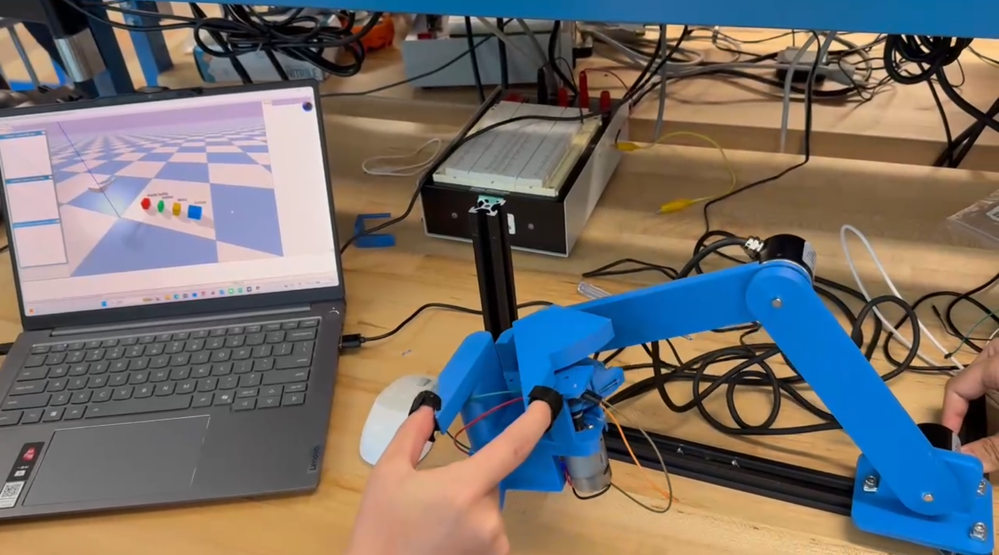

# Haptic Teleoperation Gripper System

## Overview

This project presents a hardware-in-the-loop (HIL) haptic device designed for teleoperation and human-machine interaction. The system consists of a 2-DOF planar linkage for position input and a 1-DOF force-feedback gripper that enables users to perceive virtual object interactions through kinesthetic feedback.

The device captures user motion using encoders and renders force feedback via a DC motor, forming a closed-loop interaction with a virtual environment.

---

## System Architecture

* **Mechanical System**

  * 2-DOF planar linkage for end-effector positioning
  * 1-DOF gripper handle with integrated DC motor for force feedback

* **Sensing**

  * Incremental encoders (Model 3806) for joint angle measurement
  * AS5600 magnetic encoder for absolute gripper angle sensing

* **Embedded System**

  * Arduino-based real-time processing
  * Quadrature decoding and angle computation
  * Motor control for haptic rendering

* **Interface**

  * Serial communication with external simulation (e.g., PyBullet)
  * Enables hardware-in-the-loop interaction

---

## My Contributions

* Designed the **2-DOF linkage mechanism** and **force-feedback handle**
* Performed **component selection** (encoders, motor, sensors)
* Integrated **incremental encoders and AS5600 sensor**
* Developed **Arduino firmware** for sensing and motor control
* Implemented **real-time data acquisition and actuation pipeline**
* Diagnosed and resolved key issues:

  * Encoder drift due to improper mounting
  * Sensor-magnet misalignment
  * Mechanical friction and usability issues
* Optimized gripper geometry and ergonomics for improved user interaction

---

## Hardware

* 2-DOF planar linkage (custom CAD design)
* RS380 DC motor for force feedback
* AS5600 magnetic encoder (I2C)
* Model 3806 incremental encoders (quadrature)
* Bearing-supported rotating handle

See `/hardware` for CAD files, wiring diagrams, and BOM.

---

## Firmware

The Arduino firmware performs:

* Encoder signal decoding (quadrature)
* Angle computation and calibration
* Serial communication
* Motor control for force feedback

Located in:

```bash
/firmware/arduino_main/
```

---

## Control and Modeling

* Forward kinematics for 2R planar linkage
* Real-time position tracking
* Haptic rendering using a virtual wall model
* Force output based on stiffness and penetration depth

See `/control` for details.

---

## Hardware-Software Interface

The system communicates with an external simulation via serial:

**Output (Arduino → Simulation):**

* End-effector position (x, y)
* Gripper angle (α)

**Input (Simulation → Arduino):**

* Contact threshold
* Virtual stiffness

This enables real-time hardware-in-the-loop interaction.

---

## Results

* Stable position tracking after mechanical refinement
* Improved accuracy through proper encoder mounting
* Smooth and responsive force feedback
* Enhanced user interaction through ergonomic design improvements

---

## Project Structure

```bash
hardware/      # CAD, drawings, electronics
firmware/      # Arduino code
control/       # kinematics and haptic models
experiments/   # testing and observations
docs/          # report and figures
interface/     # communication protocol
```

---

## Demo

[](https://www.bilibili.com/video/BV1hrQpB5Ezd) 

---

## Future Work

* Improve sensing accuracy and calibration
* Reduce mechanical friction and backlash
* Enhance force feedback with advanced control strategies
* Integrate more complex virtual environments

---

## Acknowledgment
This project was conducted at the University of California, San Diego under the supervision of Professor Tania Morimoto.


## 中文说明（Chinese Version）

### 项目简介

本项目设计并实现了一种基于硬件在环（Hardware-in-the-Loop, HIL）的触觉遥操作装置。系统由一个二维平面连杆机构（2-DOF）和一个具有力反馈功能的夹爪手柄（1-DOF）组成，实现了用户动作输入与虚拟环境交互之间的闭环控制。

系统通过编码器采集用户运动信息，并利用直流电机输出力反馈，使用户能够感知虚拟物体的接触与刚度特性，从而提升人机交互的真实感。

---

### 系统结构

* **机械结构**

  * 二自由度平面连杆机构（用于末端位置输入）
  * 一自由度力反馈手柄（集成电机实现夹爪开合与力反馈）

* **传感器系统**

  * 3806 增量式编码器（用于关节角度测量）
  * AS5600 磁编码器（用于夹爪绝对角度测量）

* **嵌入式系统**

  * 基于 Arduino 的实时数据采集与控制
  * 编码器信号正交解码与角度计算
  * 电机驱动与力反馈控制

* **系统接口**

  * 通过串口与外部仿真环境（如 PyBullet）通信
  * 支持硬件在环（HIL）实时交互

---

### 本人工作内容

* 主导 **2自由度连杆机构与力反馈手柄的机械设计**
* 完成 **关键元件选型**（编码器、电机、传感器等）
* 实现 **增量式编码器与AS5600磁编码器的集成**
* 开发 **Arduino嵌入式程序**，实现数据采集与力反馈控制
* 搭建 **完整硬件系统并完成系统级集成**
* 解决关键工程问题：

  * 编码器安装不牢导致的测量误差问题
  * AS5600 磁铁与传感器对齐问题
  * 机械摩擦与结构稳定性问题
* 优化夹爪结构与人机交互设计，提高操作稳定性与触觉感知效果

---

### 硬件系统

* 2自由度平面连杆机构（自定义CAD设计）
* RS380 直流电机（用于力反馈）
* AS5600 磁编码器（I2C通信）
* 3806 增量式编码器（正交输出）
* 轴承支撑的旋转手柄结构

详细硬件设计（包括CAD模型、接线图与物料清单）详见 `/hardware` 目录。

---

### 嵌入式程序

Arduino程序实现以下功能：

* 编码器信号解码（正交解码）
* 角度计算与零位标定
* 串口通信（与上位机/仿真环境交互）
* 电机驱动与力反馈控制

程序代码详见 `/firmware/arduino_main/` 目录。

---

### 控制与建模

* 基于平面2R机构的正运动学进行末端位置计算
* 实现实时位置跟踪与数据映射
* 基于虚拟墙模型（Virtual Wall）实现力反馈
* 根据接触阈值与刚度参数输出反馈力

相关建模与控制细节详见 `/control` 目录。

---

### 硬件-软件接口

系统通过串口实现与外部仿真环境的数据交互：

**输出（Arduino → 仿真）：**

* 末端位置 (x, y)
* 夹爪角度 (α)

**输入（仿真 → Arduino）：**

* 接触阈值（contact threshold）
* 虚拟刚度参数（stiffness）

该机制实现了物理设备与虚拟环境之间的闭环交互（Hardware-in-the-Loop）。

---

### 实验结果

* 通过机械结构优化，实现稳定的位置跟踪
* 编码器固定后显著降低零点漂移与测量误差
* 力反馈输出平滑且响应稳定
* 结构优化后显著提升用户操作体验与交互自然性

实验数据与调试记录详见 `/experiments` 目录。

---

### 项目结构

```bash
hardware/      # 机械设计、CAD模型与电路连接
firmware/      # Arduino嵌入式控制代码
control/       # 运动学建模与力反馈算法
experiments/   # 测试记录、标定与调试过程
docs/          # 报告、图片与说明文档
interface/     # 串口通信协议说明
```

---

### 演示

（可在此添加演示视频或GIF）

---

### 后续工作

* 提升传感器精度与系统标定方法
* 降低机械摩擦与间隙误差（backlash）
* 优化力反馈控制算法（如更高阶控制策略）
* 扩展更复杂的虚拟交互环境

---

### 致谢

本项目在加州大学圣地亚哥分校完成，感谢 Tania Morimoto 教授的指导与支持。
